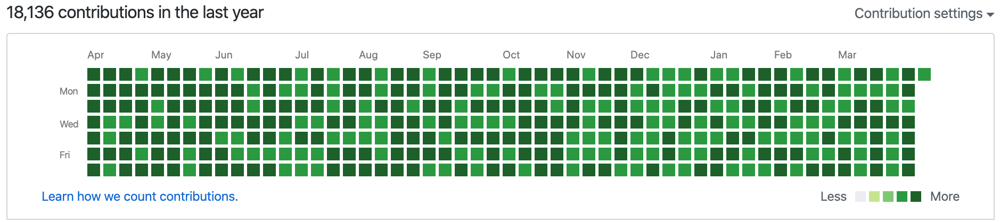

# 一键超人！

让你感受一键「自欺欺人」的感觉！



## 如何使用？

### 准备

1. 安装 [Python3](https://www.python.org/downloads/)
2. 安装 [Git](https://git-scm.com/downloads)
3. 在 GitHub 上创建一个新项目并 Clone 到本地，这里例如叫做 `one-click-man-hello-world`，并 Clone 到了 `~/one-click-man-hello-world`

### 安装并使用

```shell script
# 修改路径即可
repo_path="~/one-click-man-hello-world"

pip3 install --user git+https://github.com/thoxvi/one-click-man@master#egg=ocm --upgrade
# 等待漫长的写入
ocm $repo_path
cd $repo_path && git push
```
